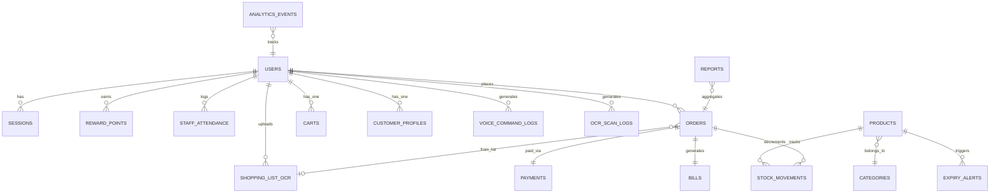

# Kiosk Vision – MongoDB Schema Design

> **Database Engine:** MongoDB 7  
> **ODM:** Motor (async) + Pydantic  
> **Strategy:** Database-per-service (microservice isolation)

---

## Database Distribution

| Database | Service | Collections |
|----------|---------|-------------|
| `kiosk_auth` | Auth & User Service | `users`, `sessions`, `reward_points`, `staff_attendance` |
| `kiosk_inventory` | Inventory Service | `products`, `categories`, `stock_movements`, `expiry_alerts` |
| `kiosk_orders` | Order & Billing Service | `carts`, `orders`, `bills` |
| `kiosk_payment` | Payment Service | `payments` |
| `kiosk_crm` | CRM & Analytics Service | `customer_profiles`, `analytics_events`, `reports` |
| `kiosk_ai` | AI Inference Service | `voice_command_logs`, `ocr_scan_logs`, `shopping_list_ocr` |

**Total: 18 collections across 6 databases**

---

## 1. Collection Schemas

---

### 1.1 `kiosk_auth.users`

**Purpose:** All user accounts – guests, daily customers, supervisors, owners.

```js
{
  _id:          String,        // UUID v4
  phone:        String | null, // Unique (sparse) – login credential
  name:         String | null,
  pin_hash:     String,        // bcrypt hash of 4-6 digit PIN
  role:         String,        // enum: "guest" | "daily_customer" | "supervisor" | "owner"

  // Customer fields
  email:            String | null,
  date_of_birth:    ISODate | null,
  profile_image_url: String | null,

  // Reward system
  reward_points:    Number,     // Current balance (default: 0)
  lifetime_points:  Number,     // Total ever earned
  tier:             String,     // "bronze" | "silver" | "gold" | "platinum"

  // Accessibility
  accessibility_preferences: {
    high_contrast:  Boolean,    // default: false
    large_text:     Boolean,    // default: false
    voice_enabled:  Boolean,    // default: true
    gesture_enabled: Boolean,   // default: true
    language:       String,     // "en" | "hi" | "ta" etc.
    tts_speed:      Number,     // 0.5 – 2.0 (default: 1.0)
    font_scale:     Number      // 1.0 – 2.0
  },

  // Staff-only fields (supervisor/owner)
  employee_id:      String | null,
  shift:            String | null,  // "morning" | "evening" | "night"
  salary:           Number | null,

  // Metadata
  last_login_at:    ISODate | null,
  device_ids:       [String],       // MAC/device fingerprints
  is_active:        Boolean,        // default: true
  created_at:       ISODate,
  updated_at:       ISODate
}
```

**Indexes:**
```js
db.users.createIndex({ "phone": 1 }, { unique: true, sparse: true })
db.users.createIndex({ "role": 1 })
db.users.createIndex({ "employee_id": 1 }, { sparse: true })
db.users.createIndex({ "reward_points": -1 })
db.users.createIndex({ "created_at": -1 })
```

---

### 1.2 `kiosk_auth.sessions`

**Purpose:** Active user sessions (TTL auto-expiry).

```js
{
  _id:          String,        // UUID v4
  user_id:      String,        // → users._id
  role:         String,
  token_hash:   String,        // Hash of JWT
  device_id:    String | null,
  ip_address:   String | null,
  is_active:    Boolean,       // default: true
  created_at:   ISODate,
  expires_at:   ISODate        // TTL – auto-deleted by MongoDB
}
```

**Indexes:**
```js
db.sessions.createIndex({ "expires_at": 1 }, { expireAfterSeconds: 0 })
db.sessions.createIndex({ "user_id": 1 })
db.sessions.createIndex({ "token_hash": 1 }, { unique: true })
```

---

### 1.3 `kiosk_auth.reward_points`

**Purpose:** Ledger of all point transactions (earn/redeem).

```js
{
  _id:          ObjectId,
  user_id:      String,           // → users._id
  order_id:     String | null,    // → orders._id (earn from purchase)
  type:         String,           // "earn" | "redeem" | "expire" | "bonus" | "adjustment"
  points:       Number,           // Positive for earn, negative for redeem
  balance_after: Number,          // Running balance after this transaction
  description:  String,           // "Purchase order #abc123" | "Redeemed 50 pts on order #xyz"
  created_at:   ISODate,
  created_by:   String            // user_id or "system"
}
```

**Indexes:**
```js
db.reward_points.createIndex({ "user_id": 1, "created_at": -1 })
db.reward_points.createIndex({ "order_id": 1 }, { sparse: true })
db.reward_points.createIndex({ "type": 1, "created_at": -1 })
```

---

### 1.4 `kiosk_auth.staff_attendance`

**Purpose:** Track staff (supervisor/owner) clock-in/clock-out.

```js
{
  _id:          ObjectId,
  user_id:      String,           // → users._id (role: supervisor/owner)
  date:         String,           // "2026-03-28"
  clock_in:     ISODate,
  clock_out:    ISODate | null,
  break_minutes: Number,          // default: 0
  total_hours:  Number | null,    // Computed on clock_out
  status:       String,           // "present" | "late" | "half_day" | "absent"
  notes:        String | null,
  created_at:   ISODate
}
```

**Indexes:**
```js
db.staff_attendance.createIndex({ "user_id": 1, "date": -1 }, { unique: true })
db.staff_attendance.createIndex({ "date": -1 })
db.staff_attendance.createIndex({ "status": 1, "date": -1 })
```

---

### 1.5 `kiosk_inventory.products`

**Purpose:** Master product catalog with pricing, stock, location, and expiry.

```js
{
  _id:              String,       // UUID v4
  name:             String,       // "Toor Dal (1kg)"
  category:         String,       // "Pulses"
  sub_category:     String | null, // "Arhar Dal"
  brand:            String | null,

  // Pricing
  price:            Number,       // MRP (₹)
  selling_price:    Number,       // Actual selling price ≤ MRP
  cost_price:       Number | null, // Purchase cost (owner only)
  unit:             String,       // "piece" | "kg" | "litre" | "pack" | "bottle"
  tax_rate:         Number,       // GST % (default: 5)

  // Identification
  barcode:          String | null, // EAN-13 / UPC
  sku:              String | null, // Internal SKU
  hsn_code:         String | null, // GST HSN code

  // Stock
  stock_quantity:   Number,       // Current stock count
  min_stock_level:  Number,       // Reorder threshold (default: 10)
  max_stock_level:  Number,       // Max shelf capacity
  is_available:     Boolean,      // stock_quantity > 0

  // Dates
  manufacturing_date: ISODate | null,
  expiry_date:        ISODate | null,
  batch_number:       String | null,

  // Location in store
  location: {
    aisle:    String,             // "1" | "2" | "A" etc.
    shelf:    String,             // "A" | "top" | "bottom"
    section:  String | null,      // "left" | "right" | "center"
    floor:    Number              // default: 0 (ground)
  },

  // Media
  description:      String | null,
  image_url:        String | null,
  thumbnail_url:    String | null,
  tags:             [String],     // ["organic", "gluten-free"]

  // Metadata
  is_active:        Boolean,      // Soft delete
  added_by:         String,       // → users._id (supervisor/owner)
  created_at:       ISODate,
  updated_at:       ISODate
}
```

**Indexes:**
```js
db.products.createIndex({ "barcode": 1 }, { unique: true, sparse: true })
db.products.createIndex({ "sku": 1 }, { unique: true, sparse: true })
db.products.createIndex({ "category": 1, "is_available": 1 })
db.products.createIndex({ "name": "text", "category": "text", "description": "text", "tags": "text" })
db.products.createIndex({ "expiry_date": 1 })
db.products.createIndex({ "stock_quantity": 1, "is_available": 1 })
db.products.createIndex({ "location.aisle": 1, "location.shelf": 1 })
db.products.createIndex({ "selling_price": 1 })
db.products.createIndex({ "created_at": -1 })
```

---

### 1.6 `kiosk_inventory.categories`

**Purpose:** Product category hierarchy.

```js
{
  _id:          String,           // "grains"
  name:         String,           // "Grains & Cereals"
  parent_id:    String | null,    // → categories._id (for sub-categories)
  icon:         String | null,    // Emoji or icon name
  sort_order:   Number,           // Display ordering
  is_active:    Boolean,
  created_at:   ISODate
}
```

**Indexes:**
```js
db.categories.createIndex({ "parent_id": 1 })
db.categories.createIndex({ "sort_order": 1 })
```

---

### 1.7 `kiosk_inventory.stock_movements`

**Purpose:** Audit log of every stock change.

```js
{
  _id:            ObjectId,
  product_id:     String,          // → products._id
  type:           String,          // "restock" | "sale" | "damage" | "expired" | "return" | "adjustment"
  quantity_change: Number,         // +50 (restock) or −3 (sale)
  quantity_before: Number,
  quantity_after:  Number,
  batch_number:   String | null,
  reason:         String,          // Free text note
  order_id:       String | null,   // → orders._id (if type=sale)
  user_id:        String,          // → users._id (who did this)
  timestamp:      ISODate
}
```

**Indexes:**
```js
db.stock_movements.createIndex({ "product_id": 1, "timestamp": -1 })
db.stock_movements.createIndex({ "type": 1, "timestamp": -1 })
db.stock_movements.createIndex({ "order_id": 1 }, { sparse: true })
db.stock_movements.createIndex({ "timestamp": -1 })
```

---

### 1.8 `kiosk_inventory.expiry_alerts`

**Purpose:** Proactive alerts for products nearing expiry.

```js
{
  _id:            ObjectId,
  product_id:     String,          // → products._id
  product_name:   String,          // Denormalized for fast reads
  batch_number:   String | null,
  expiry_date:    ISODate,
  days_until_expiry: Number,       // Pre-computed
  alert_level:    String,          // "warning" (≤30d) | "critical" (≤7d) | "expired" (≤0d)
  stock_quantity: Number,          // How many units affected
  is_resolved:    Boolean,         // Marked resolved after action taken
  resolved_action: String | null,  // "removed" | "discounted" | "returned_to_vendor"
  resolved_by:    String | null,   // → users._id
  resolved_at:    ISODate | null,
  created_at:     ISODate,
  updated_at:     ISODate
}
```

**Indexes:**
```js
db.expiry_alerts.createIndex({ "expiry_date": 1 })
db.expiry_alerts.createIndex({ "alert_level": 1, "is_resolved": 1 })
db.expiry_alerts.createIndex({ "product_id": 1 })
```

---

### 1.9 `kiosk_orders.carts`

**Purpose:** Active shopping carts (one per user).

```js
{
  _id:          ObjectId,
  user_id:      String,            // → users._id (unique per user)

  items: [{
    product_id:   String,          // → products._id
    product_name: String,          // Denormalized
    barcode:      String | null,
    quantity:     Number,
    unit:         String,
    unit_price:   Number,
    total_price:  Number,          // quantity × unit_price
    added_via:    String           // "voice" | "barcode" | "ocr" | "manual" | "gesture"
  }],

  subtotal:     Number,
  item_count:   Number,

  // Reward points
  points_available: Number,        // User's current redeemable points
  points_to_apply:  Number,        // Points user wants to use

  created_at:   ISODate,
  updated_at:   ISODate
}
```

**Indexes:**
```js
db.carts.createIndex({ "user_id": 1 }, { unique: true })
db.carts.createIndex({ "updated_at": 1 }, { expireAfterSeconds: 86400 }) // Auto-expire after 24h
```

---

### 1.10 `kiosk_orders.orders`

**Purpose:** Completed orders with delivery tracking.

```js
{
  _id:            String,          // UUID v4
  order_number:   String,          // Human-readable: "KV-20260328-001"
  user_id:        String,          // → users._id
  user_name:      String | null,   // Denormalized
  user_phone:     String | null,   // Denormalized

  items: [{
    product_id:   String,
    product_name: String,
    barcode:      String | null,
    quantity:     Number,
    unit:         String,
    unit_price:   Number,
    tax_rate:     Number,          // Per-item tax %
    tax_amount:   Number,
    total_price:  Number,          // (qty × price) + tax
    added_via:    String           // "voice" | "barcode" | "ocr" | "manual"
  }],

  // Pricing
  subtotal:       Number,
  tax_percent:    Number,
  tax_amount:     Number,
  discount_amount: Number,         // default: 0
  points_redeemed: Number,         // Reward points used (default: 0)
  points_value:   Number,          // ₹ equivalent of redeemed points
  points_earned:  Number,          // Points earned from this order
  total:          Number,          // Final amount to pay

  // Status
  status:         String,          // "draft" | "confirmed" | "billing" | "payment_pending"
                                   // "paid" | "preparing" | "out_for_delivery" | "completed" | "cancelled"

  // Delivery
  delivery_type:  String,          // "pickup" | "service_boy" | "home_delivery"
  delivery_address: {              // Only for home_delivery
    line1:    String,
    line2:    String | null,
    pincode:  String,
    landmark: String | null
  } | null,
  delivery_boy_id:  String | null, // → users._id (staff assigned)
  delivery_notes:   String | null,
  estimated_delivery: ISODate | null,
  delivered_at:   ISODate | null,

  // Billing
  billed_by:      String | null,   // → users._id (supervisor)
  bill_id:        String | null,   // → bills._id

  // AI / Input source
  input_source:   String,          // "voice" | "ocr_list" | "barcode" | "manual" | "mixed"
  voice_transcript: String | null,
  ocr_source_id:  String | null,   // → shopping_list_ocr._id

  notes:          String | null,
  created_at:     ISODate,
  updated_at:     ISODate
}
```

**Indexes:**
```js
db.orders.createIndex({ "user_id": 1, "created_at": -1 })
db.orders.createIndex({ "status": 1, "created_at": -1 })
db.orders.createIndex({ "order_number": 1 }, { unique: true })
db.orders.createIndex({ "delivery_type": 1, "status": 1 })
db.orders.createIndex({ "delivery_boy_id": 1, "status": 1 }, { sparse: true })
db.orders.createIndex({ "created_at": -1 })
db.orders.createIndex({ "billed_by": 1 }, { sparse: true })
db.orders.createIndex({ "input_source": 1 })
```

---

### 1.11 `kiosk_orders.bills`

**Purpose:** Tax invoices / billing records.

```js
{
  _id:              String,        // UUID v4
  bill_number:      String,        // "INV-20260328-001"
  order_id:         String,        // → orders._id
  user_id:          String,        // → users._id

  // Line items (denormalized from order)
  items: [{
    product_name:   String,
    quantity:       Number,
    unit_price:     Number,
    tax_rate:       Number,
    tax_amount:     Number,
    total:          Number
  }],

  // Totals
  subtotal:         Number,
  tax_percent:      Number,
  tax_amount:       Number,
  discount_amount:  Number,
  points_redeemed:  Number,
  points_discount:  Number,         // ₹ value of redeemed pts
  grand_total:      Number,

  // Payment
  payment_method:   String,         // "upi" | "cash" | "card" | "points_only"
  payment_status:   String,         // "pending" | "confirmed" | "failed" | "refunded"
  payment_id:       String | null,  // → payments._id

  // Meta
  billed_by:        String,         // → users._id (supervisor)
  receipt_url:      String | null,  // MinIO path to PDF receipt
  created_at:       ISODate
}
```

**Indexes:**
```js
db.bills.createIndex({ "order_id": 1 }, { unique: true })
db.bills.createIndex({ "bill_number": 1 }, { unique: true })
db.bills.createIndex({ "user_id": 1, "created_at": -1 })
db.bills.createIndex({ "payment_status": 1 })
db.bills.createIndex({ "created_at": -1 })
db.bills.createIndex({ "billed_by": 1, "created_at": -1 })
```

---

### 1.12 `kiosk_payment.payments`

**Purpose:** Payment transaction records.

```js
{
  _id:              String,        // UUID v4
  order_id:         String,        // → orders._id
  bill_id:          String | null,  // → bills._id

  // Amount
  amount:           Number,
  currency:         String,         // "INR"

  // Method
  method:           String,         // "upi" | "cash" | "card"
  upi_uri:          String | null,  // UPI intent URI
  upi_txn_id:       String | null,  // Transaction ref (if available)
  qr_code_base64:   String | null,  // Generated QR image

  // Status
  status:           String,          // "pending" | "confirmed" | "failed" | "refunded"

  // Confirmation
  confirmed_by:     String | null,   // → users._id (supervisor)
  confirmed_at:     ISODate | null,
  confirmation_note: String | null,

  // Refund
  refund_amount:    Number | null,
  refund_reason:    String | null,
  refunded_at:      ISODate | null,
  refunded_by:      String | null,

  expires_at:       ISODate | null,  // QR expiry
  created_by:       String,          // → users._id
  created_at:       ISODate,
  updated_at:       ISODate
}
```

**Indexes:**
```js
db.payments.createIndex({ "order_id": 1 }, { unique: true })
db.payments.createIndex({ "status": 1, "created_at": -1 })
db.payments.createIndex({ "method": 1, "created_at": -1 })
db.payments.createIndex({ "confirmed_by": 1 }, { sparse: true })
db.payments.createIndex({ "expires_at": 1 }, { expireAfterSeconds: 0, sparse: true })
```

---

### 1.13 `kiosk_crm.customer_profiles`

**Purpose:** Aggregated customer analytics (materialized view).

```js
{
  _id:              String,        // Same as users._id
  name:             String | null,
  phone:            String | null,

  // Purchase stats
  total_orders:     Number,
  total_spent:      Number,
  avg_order_value:  Number,
  total_items_bought: Number,

  // Preferences
  favorite_products:   [{ product_id: String, product_name: String, count: Number }],
  favorite_categories: [{ category: String, count: Number }],
  preferred_delivery:  String,       // Most used delivery_type
  preferred_payment:   String,       // Most used payment method

  // Engagement
  visit_count:       Number,
  last_visit_at:     ISODate | null,
  first_visit_at:    ISODate,
  avg_days_between_visits: Number | null,

  // Reward
  current_points:    Number,
  lifetime_points:   Number,
  tier:              String,

  // AI interaction stats
  voice_orders_count:   Number,
  ocr_orders_count:     Number,
  barcode_orders_count: Number,

  updated_at:        ISODate
}
```

**Indexes:**
```js
db.customer_profiles.createIndex({ "total_spent": -1 })
db.customer_profiles.createIndex({ "visit_count": -1 })
db.customer_profiles.createIndex({ "last_visit_at": -1 })
db.customer_profiles.createIndex({ "tier": 1 })
```

---

### 1.14 `kiosk_crm.analytics_events`

**Purpose:** Raw event stream for all user interactions.

```js
{
  _id:          ObjectId,
  event_type:   String,            // "voice_order" | "gesture_nav" | "ocr_scan" | "barcode_scan"
                                   // "tts_play" | "page_view" | "product_search" | "cart_add"
                                   // "checkout" | "payment" | "login" | "session_start"
  user_id:      String,            // → users._id
  session_id:   String | null,     // → sessions._id

  data: {                          // Event-specific payload
    // examples:
    product_id:   String,
    product_name: String,
    query:        String,
    page:         String,
    duration_ms:  Number,
    source:       String           // "voice" | "manual" | "barcode"
  },

  device_info: {
    user_agent:   String | null,
    screen_size:  String | null
  },

  timestamp:    ISODate
}
```

**Indexes:**
```js
db.analytics_events.createIndex({ "timestamp": -1 })
db.analytics_events.createIndex({ "event_type": 1, "timestamp": -1 })
db.analytics_events.createIndex({ "user_id": 1, "timestamp": -1 })
// TTL: auto-delete events older than 90 days
db.analytics_events.createIndex({ "timestamp": 1 }, { expireAfterSeconds: 7776000 })
```

---

### 1.15 `kiosk_crm.reports`

**Purpose:** Pre-computed daily/weekly/monthly reports (for owner dashboard).

```js
{
  _id:          ObjectId,
  report_type:  String,           // "daily" | "weekly" | "monthly"
  period:       String,           // "2026-03-28" | "2026-W13" | "2026-03"

  sales: {
    total_orders:   Number,
    total_revenue:  Number,
    avg_order_value: Number,
    total_items_sold: Number
  },

  top_products: [{
    product_id:   String,
    product_name: String,
    quantity_sold: Number,
    revenue:      Number
  }],

  top_categories: [{ category: String, revenue: Number }],

  customers: {
    new_customers:     Number,
    returning_customers: Number,
    total_unique:      Number
  },

  payments: {
    upi_count:   Number,  upi_amount:  Number,
    cash_count:  Number,  cash_amount: Number
  },

  ai_usage: {
    voice_commands:  Number,
    ocr_scans:       Number,
    barcode_scans:   Number,
    gesture_actions: Number
  },

  generated_at:   ISODate,
  generated_by:   String           // "system" | user_id
}
```

**Indexes:**
```js
db.reports.createIndex({ "report_type": 1, "period": -1 }, { unique: true })
db.reports.createIndex({ "generated_at": -1 })
```

---

### 1.16 `kiosk_ai.voice_command_logs`

**Purpose:** Audit log of all voice interactions for quality tracking.

```js
{
  _id:            ObjectId,
  user_id:        String,          // → users._id
  session_id:     String | null,

  // Input
  audio_duration_ms: Number,
  audio_format:   String,          // "webm" | "wav" | "ogg"
  language:       String,          // "en"

  // STT result
  transcript:     String,
  stt_confidence: Number,          // 0.0 – 1.0
  stt_model:      String,          // "whisper-small"
  stt_latency_ms: Number,

  // LLM intent result
  intent:         String,          // "add_to_cart" | "search_product" etc.
  entities:       Object,          // { product_name: "rice", quantity: 2 }
  llm_confidence: Number,
  llm_model:      String,          // "mistral-7b-q4"
  llm_latency_ms: Number,

  // Action taken
  action_taken:   String | null,   // "added Rice 5kg to cart"
  action_success: Boolean,

  // TTS response
  response_text:  String | null,
  tts_generated:  Boolean,

  timestamp:      ISODate
}
```

**Indexes:**
```js
db.voice_command_logs.createIndex({ "user_id": 1, "timestamp": -1 })
db.voice_command_logs.createIndex({ "intent": 1, "timestamp": -1 })
db.voice_command_logs.createIndex({ "action_success": 1 })
db.voice_command_logs.createIndex({ "timestamp": 1 }, { expireAfterSeconds: 2592000 }) // 30 day TTL
```

---

### 1.17 `kiosk_ai.ocr_scan_logs`

**Purpose:** Log of product label / price tag OCR scans.

```js
{
  _id:            ObjectId,
  user_id:        String,
  session_id:     String | null,

  // Input
  image_url:      String | null,    // MinIO path (optional storage)
  scan_type:      String,           // "product_label" | "price_tag" | "barcode"
  image_size:     { width: Number, height: Number },

  // OCR result
  raw_text:       String,           // Full extracted text
  ocr_confidence: Number,           // 0.0 – 1.0
  ocr_engine:     String,           // "tesseract-5"
  ocr_latency_ms: Number,

  // Parsed data
  parsed_product: {
    name:         String | null,
    price:        Number | null,
    barcode:      String | null,
    brand:        String | null,
    weight:       String | null
  },

  // Match result
  matched_product_id: String | null, // → products._id (if found in catalog)
  match_confidence:   Number | null,

  timestamp:      ISODate
}
```

**Indexes:**
```js
db.ocr_scan_logs.createIndex({ "user_id": 1, "timestamp": -1 })
db.ocr_scan_logs.createIndex({ "scan_type": 1 })
db.ocr_scan_logs.createIndex({ "matched_product_id": 1 }, { sparse: true })
db.ocr_scan_logs.createIndex({ "timestamp": 1 }, { expireAfterSeconds: 2592000 }) // 30 day TTL
```

---

### 1.18 `kiosk_ai.shopping_list_ocr`

**Purpose:** Handwritten shopping list OCR processing records.

```js
{
  _id:            String,           // UUID v4
  user_id:        String,
  session_id:     String | null,

  // Input
  image_url:      String | null,    // MinIO path to original image
  image_size:     { width: Number, height: Number },

  // OCR pass
  raw_text:       String,           // Raw Tesseract output
  ocr_confidence: Number,
  ocr_engine:     String,

  // LLM post-processing
  parsed_items: [{
    raw_text:     String,           // Original line from OCR
    name:         String,           // Cleaned product name
    quantity:     Number,           // Parsed quantity (default: 1)
    unit:         String | null,    // "kg" | "pcs" | "litre"
    matched_product_id: String | null, // → products._id
    match_confidence:   Number | null,
    is_ambiguous: Boolean           // LLM wasn't sure
  }],

  llm_model:      String,
  llm_latency_ms: Number,

  // Status
  total_items_detected: Number,
  total_items_matched:  Number,
  status:         String,           // "processed" | "partial" | "failed"
  order_id:       String | null,    // → orders._id (if converted to order)

  timestamp:      ISODate
}
```

**Indexes:**
```js
db.shopping_list_ocr.createIndex({ "user_id": 1, "timestamp": -1 })
db.shopping_list_ocr.createIndex({ "status": 1 })
db.shopping_list_ocr.createIndex({ "order_id": 1 }, { sparse: true })
db.shopping_list_ocr.createIndex({ "timestamp": 1 }, { expireAfterSeconds: 2592000 })
```

---

## 2. Relationships Diagram



---

## 3. Example Documents

### User (Daily Customer)
```json
{
  "_id": "usr_a1b2c3d4e5f6",
  "phone": "9876543210",
  "name": "Priya Sharma",
  "pin_hash": "$2b$12$...",
  "role": "daily_customer",
  "reward_points": 250,
  "lifetime_points": 1450,
  "tier": "silver",
  "accessibility_preferences": {
    "high_contrast": false,
    "large_text": true,
    "voice_enabled": true,
    "gesture_enabled": false,
    "language": "hi",
    "tts_speed": 0.8,
    "font_scale": 1.5
  },
  "last_login_at": "2026-03-27T18:30:00Z",
  "device_ids": ["a1b2c3"],
  "is_active": true,
  "created_at": "2026-01-15T10:00:00Z",
  "updated_at": "2026-03-27T18:30:00Z"
}
```

### Product
```json
{
  "_id": "prod_001",
  "name": "Toor Dal (1kg)",
  "category": "Pulses",
  "brand": "Tata Sampann",
  "price": 150,
  "selling_price": 130,
  "unit": "pack",
  "tax_rate": 5,
  "barcode": "8901234567893",
  "stock_quantity": 45,
  "min_stock_level": 10,
  "max_stock_level": 100,
  "is_available": true,
  "manufacturing_date": "2026-02-01T00:00:00Z",
  "expiry_date": "2027-02-01T00:00:00Z",
  "batch_number": "BTH-2026-02-A",
  "location": { "aisle": "2", "shelf": "A", "section": "left", "floor": 0 },
  "tags": ["protein", "daily-essential"],
  "is_active": true,
  "added_by": "u-supervisor-01",
  "created_at": "2026-01-10T08:00:00Z",
  "updated_at": "2026-03-27T14:00:00Z"
}
```

### Order (Home Delivery)
```json
{
  "_id": "ord_20260328_001",
  "order_number": "KV-20260328-001",
  "user_id": "usr_a1b2c3d4e5f6",
  "user_name": "Priya Sharma",
  "items": [
    {
      "product_id": "prod_001",
      "product_name": "Toor Dal (1kg)",
      "quantity": 2,
      "unit_price": 130,
      "tax_rate": 5,
      "tax_amount": 13,
      "total_price": 273,
      "added_via": "voice"
    }
  ],
  "subtotal": 260,
  "tax_amount": 13,
  "discount_amount": 0,
  "points_redeemed": 50,
  "points_value": 5,
  "points_earned": 13,
  "total": 268,
  "status": "paid",
  "delivery_type": "home_delivery",
  "delivery_address": { "line1": "123 Main St", "pincode": "600001" },
  "delivery_boy_id": "u-staff-02",
  "estimated_delivery": "2026-03-28T17:00:00Z",
  "input_source": "voice",
  "voice_transcript": "I need 2 packets of toor dal",
  "created_at": "2026-03-28T14:30:00Z",
  "updated_at": "2026-03-28T14:35:00Z"
}
```

### Voice Command Log
```json
{
  "user_id": "usr_a1b2c3d4e5f6",
  "audio_duration_ms": 3200,
  "language": "hi",
  "transcript": "मुझे 2 किलो चावल और 1 किलो चीनी चाहिए",
  "stt_confidence": 0.92,
  "stt_model": "whisper-small",
  "stt_latency_ms": 1800,
  "intent": "add_to_cart",
  "entities": { "items": [{ "name": "rice", "qty": 2, "unit": "kg" }, { "name": "sugar", "qty": 1, "unit": "kg" }] },
  "llm_confidence": 0.88,
  "llm_model": "mistral-7b-q4",
  "llm_latency_ms": 2400,
  "action_taken": "Added 2kg Rice and 1kg Sugar to cart",
  "action_success": true,
  "response_text": "Done! I've added 2kg Rice and 1kg Sugar to your cart.",
  "tts_generated": true,
  "timestamp": "2026-03-28T14:30:05Z"
}
```

---

## 4. Scalability Considerations

### 4.1 Data Volume Estimates (per shop, per month)

| Collection | Est. Documents | Avg Doc Size | Monthly Growth |
|-----------|---------------|-------------|---------------|
| `users` | 500 – 2,000 | 1 KB | Low (plateaus) |
| `products` | 500 – 5,000 | 2 KB | Low |
| `orders` | 3,000 – 15,000 | 3 KB | Steady |
| `stock_movements` | 10,000 – 50,000 | 500 B | High |
| `analytics_events` | 50,000 – 200,000 | 300 B | High (TTL cleans) |
| `voice_command_logs` | 5,000 – 20,000 | 1 KB | Moderate (TTL cleans) |

### 4.2 Performance Strategy

| Strategy | Implementation |
|----------|---------------|
| **TTL Indexes** | Sessions (30m), carts (24h), analytics (90d), AI logs (30d) |
| **Denormalization** | Product name in order items, user name in orders – avoids cross-DB joins |
| **Covered Indexes** | All frequent queries use indexed fields only |
| **Text Indexes** | Products collection for fuzzy voice/text search |
| **Capped Collections** | Consider for analytics_events if disk constrained |
| **Read Preference** | `primaryPreferred` (single-node LAN deployment) |

### 4.3 Backup Strategy

```bash
# Daily backup (cron on shop server)
mongodump --uri="mongodb://localhost:27017" \
  --out=/backups/$(date +%Y-%m-%d) \
  --gzip

# Retain 30 days of backups
find /backups -type d -mtime +30 -exec rm -rf {} +
```

### 4.4 Multi-Shop Scaling (Future)

| Approach | How |
|----------|-----|
| **Database-per-shop** | Each shop gets `kiosk_auth_shop1`, `kiosk_orders_shop1` etc. |
| **Tenant field** | Add `shop_id` to every collection, compound indexes |
| **Replication** | MongoDB Replica Set for HA (3 nodes in larger shops) |
| **Sharding** | Shard `analytics_events` and `orders` by `created_at` range |

### 4.5 Indexing Cost Analysis

| Collection | Index Count | Est. Index Size | Notes |
|-----------|------------|----------------|-------|
| `products` | 9 | ~5 MB | Text index is largest |
| `orders` | 8 | ~15 MB | Grows with order volume |
| `analytics_events` | 4 | ~20 MB | TTL keeps it bounded |
| `stock_movements` | 4 | ~10 MB | Append-only audit log |
| All others | 2–4 each | ~1–3 MB each | Lightweight |
| **Total** | ~50 | ~60–80 MB | Well within 16GB RAM |
